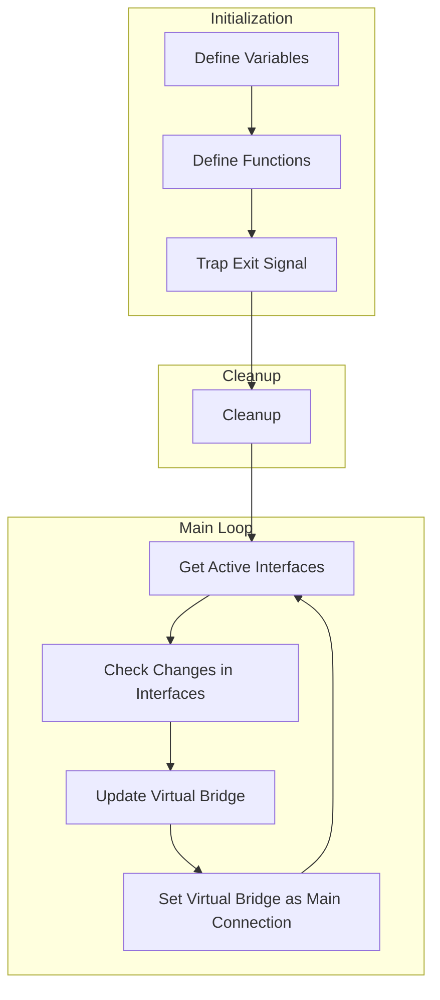

# Network Redundancy Script

## Table of Contents
- [Introduction](#introduction)
- [Prerequisites](#prerequisites)
- [How to Run](#how-to-run)
- [Run as a Service (systemd)](#run-as-a-service-systemd)
- [Run as a Service (rc.local)](#run-as-a-service-rclocal)
- [Removing the Service](#removing-the-service)
- [Flowchart](#flowchart)

## Introduction
This script is designed to create a virtual bridge that combines a specified main connection with other active network interfaces. It continuously monitors the network interfaces, dynamically adjusting the virtual bridge for network redundancy. This is particularly useful in scenarios where multiple network connections are available, providing a seamless and automatic failover mechanism.

## Prerequisites
Ensure your system meets the following requirements:
- Linux operating system.
- The `ip`, `brctl`, and `awk` commands are available.
- `sudo` privileges are required to execute the script.

## How to Run
1. **Clone or Download the Script:**
   ```bash
   git clone https://github.com/yourusername/network-redundancy-script.git
   ```
   Replace the URL with the actual path if you are downloading manually.

2. **Make the Script Executable:**
   ```bash
   chmod +x /path/to/network_redundancy.sh
   ```

3. **Run the Script with sudo:**
   ```bash
   sudo /path/to/network_redundancy.sh
   ```

   This will execute the script with elevated privileges necessary for managing network interfaces.

## Run as a Service (systemd)
1. **Create a systemd Service File:**
   Create a new service file for systemd. Open an editor and create `/etc/systemd/system/network_redundancy.service` with the following content:
   ```ini
   [Unit]
   Description=Network Redundancy Script

   [Service]
   ExecStart=/path/to/network_redundancy.sh
   Restart=always
   User=root
   Group=root

   [Install]
   WantedBy=multi-user.target
   ```
   Replace `/path/to/network_redundancy.sh` with the actual path to your script.

2. **Reload systemd:**
   ```bash
   sudo systemctl daemon-reload
   ```

3. **Enable the Service to Start on Boot:**
   ```bash
   sudo systemctl enable network_redundancy.service
   ```

4. **Start the Service:**
   ```bash
   sudo systemctl start network_redundancy.service
   ```

   The script will now run as a service and automatically start on system boot.

## Run as a Service (rc.local)
1. **Edit the rc.local File:**
   Edit the `rc.local` file using your preferred text editor:
   ```bash
   sudo nano /etc/rc.local
   ```

2. **Add the Command to Run the Script:**
   Add the following line before `exit 0`:
   ```bash
   /path/to/network_redundancy.sh &
   ```
   Replace `/path/to/network_redundancy.sh` with the actual path to your script.

3. **Make rc.local Executable:**
   ```bash
   sudo chmod +x /etc/rc.local
   ```

4. **Reboot Your System:**
   ```bash
   sudo reboot
   ```

   The script will run automatically on system boot using `rc.local`.

## Removing the Service
1. **If Using systemd:**
   ```bash
   sudo systemctl disable network_redundancy.service
   sudo systemctl stop network_redundancy.service
   ```

2. **If Using rc.local:**
   Remove the line added to `rc.local`.

3. **Delete the systemd Service File (if created):**
   ```bash
   sudo rm /etc/systemd/system/network_redundancy.service
   ```

4. **Reboot Your System:**
   ```bash
   sudo reboot
   ```

5. **Remove the Script (if no longer needed):**
   ```bash
   rm /path/to/network_redundancy.sh
   ```

   The script and associated configurations will be removed from your system.

## Flowchart


